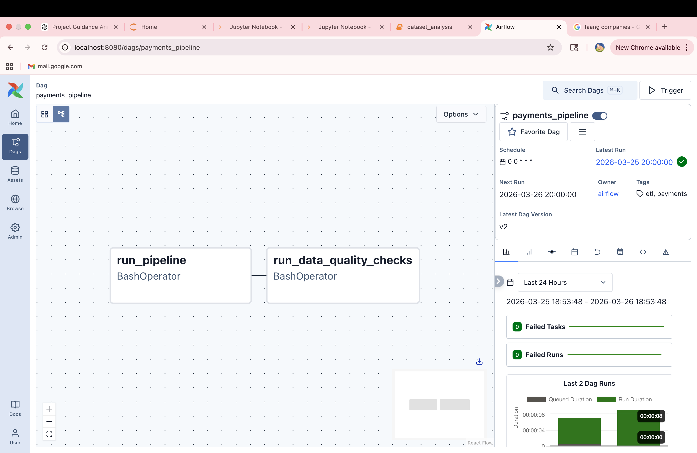
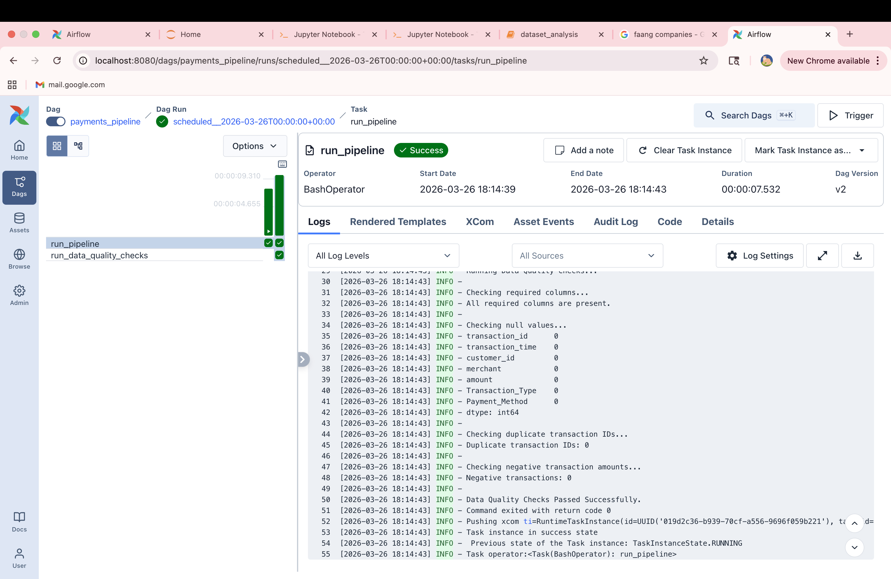

# 💳 Payments Analytics Data Pipeline

## 📌 Overview

This project implements an end-to-end **Data Engineering Pipeline** using a **Medallion Architecture (Bronze → Silver → Gold)** to process and analyze credit card transaction data.

The pipeline is fully automated using **Apache Airflow**, with built-in **data quality checks, logging, and orchestration** to ensure reliable and production-ready analytics.

---

## 🏗️ Architecture

```
Raw Data → Bronze → Silver → Gold → Analytics
```

### 🥉 Bronze Layer

* Raw data ingestion from source dataset
* Initial cleaning and preprocessing
* Dataset size: ~100,000 records

### 🥈 Silver Layer

* Structured and cleaned analytical tables
* Created datasets:

  * customers_table
  * merchants_table
  * transactions_table
  * fraud_signals_table

### 🥇 Gold Layer

* Business-level aggregated insights:

  * customer_spending_summary
  * merchant_performance_summary
  * fraud_analysis_summary
  * transaction_trend_summary

---

## 📈 Business Impact

This pipeline enables:

* Customer behavior analysis (spending patterns and segmentation)
* Fraud detection insights using transaction-level signals
* Merchant performance tracking for revenue optimization
* Transaction trend analysis over time

This project simulates real-world fintech analytics use cases similar to platforms used in companies like Stripe, PayPal, and banking systems.

---

## ⚙️ Pipeline Orchestration (Airflow)

* DAG: `payments_pipeline`
* Tasks:

  * run_pipeline
  * run_data_quality_checks

### Features:

* Task dependencies
* Retry logic for failure handling
* Logging with timestamps
* Automated scheduling using Airflow

---

## ✅ Data Quality Checks

Implemented validations:

* Required columns validation
* Null value detection
* Duplicate transaction ID detection
* Negative transaction amount detection

---

## 📊 Sample Outputs

* transactions_table.csv
* customers_table.csv
* merchant_performance_summary.csv
* fraud_analysis_summary.csv

---

## 📁 Project Structure

```
payments-analytics-platform/
│
├── data/
├── pipelines/
│   ├── bronze_pipeline.py
│   ├── silver_pipeline.py
│   ├── gold_pipeline.py
│   ├── data_quality_checks.py
│   └── run_pipeline.py
│
├── airflow/
│   └── dags/
│       └── payments_pipeline_dag.py
│
├── notebooks/
├── requirements.txt
└── README.md
```

---

## 🧰 Tech Stack

* Python
* Pandas
* Apache Airflow
* CSV-based Data Lake

---

## 🚀 How to Run

```bash
# Run pipeline locally
python pipelines/run_pipeline.py

# Start Airflow
airflow standalone
```

---

## 📸 Screenshots

(Add screenshots inside an `images/` folder)

### Airflow DAG



### Pipeline Logs



---

## 💡 Key Highlights

* End-to-end ETL pipeline (Bronze → Silver → Gold)
* Automated orchestration using Apache Airflow
* Production-style logging and monitoring
* Data validation layer for reliability
* Modular and scalable pipeline design

---
## 🎯 Project Outcomes

This project demonstrates:

- End-to-end ETL pipeline development using Python
- Bronze, Silver, and Gold data modeling approach
- Workflow orchestration with Apache Airflow
- Data quality validation and monitoring
- Retry handling and simulated failure alerts
- Config-driven pipeline design using YAML

## 📌 What I Learned

- How to design modular ETL pipelines
- How to orchestrate workflows with Airflow DAGs
- How to implement production-style retry and alert logic
- How to improve maintainability using configuration files
- How to structure analytics-ready datasets from raw transaction data

## 👩‍💻 Author

**Bhavyasree Kagitha**
